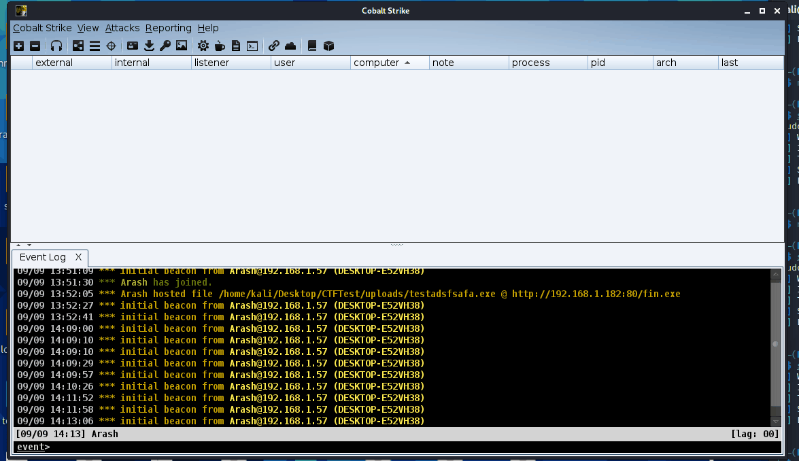

# LockdExeDemo
A demo of the relevant blog post: [Hook Heaps and Live Free](https://www.arashparsa.com/hook-heaps-and-live-free/)

## DEMO

### Explanation
There are 2 compile types.

The first is an EXE.  The EXE requires some sort of shellcode (I used staged cobalt strike shellcode from the payload generator).  You can validate this works by running your shellcode and using [BeaconEye](https://github.com/CCob/BeaconEye).

The second compile type is a DLL that you can inject into anything, will hook sleep, and same deal as the exe, any sleep over 1 will encrypt the heap on sleep.  Cobalt Strike's EXE by default makes 2 threads for some reason that both need to function that interferes with this whereas injected a Cobalt Strike thread into another process does not.  To get this to work in a standalone CS exe that's already running may take a bit more work or a profile change.

Remember, this will work in processes like explorer.exe but it'll freeze the whole process as CS is sleeping and encrypting.  Really this version is meant for standalone processes you control.